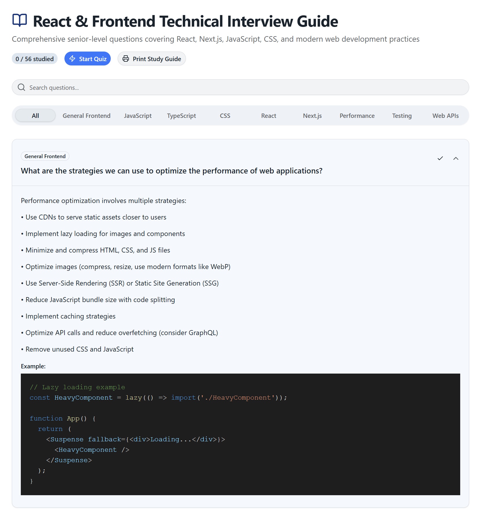

# React & Frontend Technical Interview Guide

A comprehensive, interactive study guide for senior-level frontend and React technical interviews. This application helps you prepare for interviews by organizing and presenting questions across multiple categories with detailed answers, code examples, and a quiz mode to test your knowledge.



## Features

- 📚 **50+ Technical Questions** covering React, JavaScript, TypeScript, CSS, Next.js, and more
- 🎯 **10 Categories** including General Frontend, Performance, Testing, and Web APIs
- 🔍 **Search & Filter** questions by keywords or category
- 📝 **Syntax-Highlighted Code Examples** using Prism React Renderer
- 📊 **Quiz Mode** to test your understanding with instant feedback
- 📈 **Progress Tracking** mark questions as studied and track your progress
- 🖨️ **Print Support** print your study guide for offline learning
- 🎨 **Modern UI** built with React, Tailwind CSS, and Radix UI components
- 🌙 **Dark Mode** (ready for theme switching)

## Installation Guide

### Prerequisites

- Node.js 18+
- pnpm (or npm)

### Setup

1. **Clone the repository**

    ```bash
    git clone <repository-url>
    cd frontend-interview-questions
    ```

2. **Install dependencies**

    ```bash
    pnpm install
    ```

3. **Start the development server**

    ```bash
    pnpm run dev
    ```

    The application will be available at `http://localhost:5173`

4. **Build for production**

    ```bash
    pnpm run build
    ```

5. **Preview production build**
    ```bash
    pnpm run preview
    ```

## Usage

### Studying Questions

- Browse all questions or filter by category
- Search for specific keywords
- Click on questions to expand and read detailed answers
- View code examples with syntax highlighting
- Mark questions as studied to track progress

### Quiz Mode

- Test your knowledge with randomly selected questions
- Get instant feedback on your answers
- View your score at the end
- Track quiz history

### Study Guide

- Print the entire guide for offline study
- Toggle expansion of answers for a compact view
- Category badges help organize content

## Question Categories

### [General Frontend](https://github.com) (5 questions)

- What are the strategies we can use to optimize the performance of web applications?
- What are Web Vitals (LCP, FID, CLS)? And how are they applied in the real world?
- What is the WAI-ARIA standard?
- In which cases is it worth building an SPA?
- What is CORS? How does it work?

### [JavaScript](https://github.com) (10 questions)

- What is the advantage of using a Map instead of an object?
- What is the difference between Map and WeakMap?
- What are closures?
- What is hoisting?
- How does equality work in JS? What is the difference between using === and Object.is()?
- What is the purpose of Object.freeze()?
- What is the difference between async-await and promise chains?
- How do generators work?
- What is event delegation? Why is it useful?
- What is the event loop? How does it work?

### [CSS](https://github.com) (5 questions)

- How does CSS-in-JS work?
- What are container queries?
- How does CSS Grid subgrid work?
- What is the CSS Box Model? How does box-sizing work?
- What is the difference between position: absolute, relative, fixed, and sticky?

### [React](https://github.com) (13 questions)

- What is the Virtual DOM? And why is it often more performant?
- Why does useState hook accept a function as initial value?
- What is the difference between useState and useReducer?
- Under what circumstances does a component re-render in React?
- How can we prevent unnecessary re-renders?
- What are the purposes of useRef, useMemo, and useCallback?
- What is virtualization? And what is it for?
- How does the useEffect hook work?
- How can we do event cleanup in useEffect?
- What is the recommended way to consume external data in React?
- What is the difference between server state and application state?
- What is prop drilling? How can you avoid it?
- What are controlled vs uncontrolled components?

### [TypeScript](https://github.com) (5 questions)

- What is the difference between type and interface in TypeScript?
- What are generics in TypeScript? Why are they useful?
- What are utility types in TypeScript? Name and explain some common ones.
- What is the difference between any, unknown, and never types?
- What are conditional types? How do they work?

### [Next.js](https://github.com) (7 questions)

- What is the difference between getServerSideProps and getStaticProps?
- What is the purpose of getStaticPaths?
- How does next/image work? Why does it improve performance?
- How would you deploy a Next.js app without Vercel?
- How do API routes work?
- What is a meta-framework?
- What are Server Components in Next.js?

### [Performance](https://github.com) (4 questions)

- What is code splitting and how does it improve performance?
- What is tree shaking and how does it work?
- What is memoization and when should you use it?
- What is debouncing and throttling? When would you use each?

### [Testing](https://github.com) (3 questions)

- What is the difference between unit tests, integration tests, and end-to-end tests?
- What is test-driven development (TDD)? What are its benefits?
- How do you test asynchronous code in JavaScript?

### [Web APIs](https://github.com) (4 questions)

- What is the Intersection Observer API? What is it used for?
- What is the Web Storage API? What's the difference between localStorage and sessionStorage?
- What is the Fetch API? How is it different from XMLHttpRequest?
- What are Web Workers? When should you use them?

## Project Structure

```
src/
├── components/
│   ├── ui/                 # Shadcn UI components
│   ├── App.tsx
│   ├── Header.tsx          # Application header
│   ├── QuizMode.tsx        # Quiz mode component
│   ├── CodeHighlight.tsx   # Syntax highlighted code display
│   ├── NoQuestionsFound.tsx # Empty state component
│   └── QuestionsList.tsx    # Questions list display
├── data/
│   └── questions.ts         # All interview questions
├── hooks/
│   └── use-mobile.ts
├── styles/
│   ├── theme.css           # Theme variables and imports
│   └── index.css
├── App.tsx
└── main.tsx
```

## Technology Stack

- **React 19** - UI framework
- **TypeScript** - Type safety
- **Tailwind CSS** - Styling
- **Radix UI** - Accessible component primitives
- **Lucide React** - Icons
- **Prism React Renderer** - Syntax highlighting
- **Vite** - Build tool
- **React Hook Form** - Form handling

## Keyboard Shortcuts & Tips

- **Search**: Use the search bar to find questions by keywords
- **Category Filter**: Click category tabs to filter questions
- **Quiz Mode**: Click "Start Quiz" to test your knowledge
- **Print**: Click "Print Study Guide" to print all questions
- **Mark as Studied**: Click the checkmark icon to track progress

## Local Storage

The application uses browser localStorage to persist:

- **studied-questions**: Questions you've marked as studied
- **quiz-history**: Your quiz attempts and scores

This data is stored locally and is never sent to any server.

## Contributing

Feel free to contribute by:

- Adding more questions
- Improving existing answers
- Adding more code examples
- Fixing typos or clarifications

## License

MIT License - feel free to use this for personal or commercial projects.

## Support

If you find this resource helpful, please consider:

- ⭐ Starring the repository
- 📢 Sharing with others preparing for interviews
- 📝 Contributing improvements

---

**Last Updated**: March 2026

Happy interviewing! 🚀
